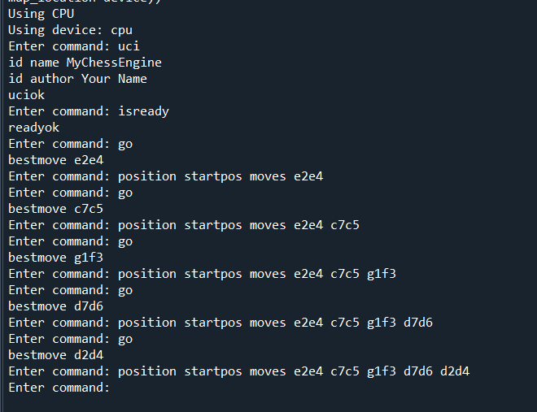

# PawnStorm

**PawnStorm** is a chess engine designed to provide intelligent move predictions using a deep learning model. This repository includes code for training and running the chess engine, which utilizes a custom-trained model to predict and make optimal moves in chess games.

## Features

- **Model-Based Prediction**: Utilizes a neural network model to predict optimal chess moves based on the current board state.
- **Device Compatibility**: Supports execution on CPU, CUDA-enabled GPUs, and Apple Silicon (MPS).
- **PGN Generation**: Records and generates PGN files for analyzed games.

## Getting Started

### Prerequisites

- Python 3.8 or higher
- PyTorch
- Chess library
- Other Python dependencies listed in `requirements.txt`

### Installation

1. **Clone the Repository**
   ```bash
   git clone https://github.com/yourusername/PawnStorm.git
   cd PawnStorm
   ```

2. **Install Dependencies**
   ```bash
   pip install -r requirements.txt
   ```

3. **Download Pre-trained Model**
   - Ensure you have the model files (`final_model.pth` and `move_to_int`) in the `chess-engine/models/` directory.

### Usage

1. **Run the Chess Engine**

   Execute the following command to start the engine and play a game:
   ```bash
   python engine.py
   ```

2. **Playing a Game**

   The engine will automatically make moves based on the current board state and generate a PGN file with the recorded game.

3. **Viewing PGN**

   The PGN file will be saved as `game.pgn` in the root directory. You can upload this file to platforms like Chess.com or Lichess.org for visualization and analysis.

### Model Architecture

   The machine learning model created in PawnStorm follows this architecture:

   Convolution layer 1 -> ReLU Activation -> Convolution layer 2 -> ReLU Activation -> Flatten -> Fully Connected Layer 1 -> ReLU Activation -> Fully connected layer 2


### Program Output Screenshot

   Here, when we type the command go the best move is predicted by the chess engine during the game and below is the output for it.
   For example: The first best move predicted by the chess engine is e2e4 and the second best move is c7c5 as shown in the screenshot below.
   


### Code Overview

- `engine.py`: The main entry point for running the chess engine.
- `model.py`: Contains the implementation of the ChessModel class.
- `auxiliary_func.py`: Includes utility functions for board representation and other tasks.
- `requirements.txt`: Lists Python dependencies.

### Contributing

   Contributions are welcome! Follow these steps to contribute:
   1. Fork the repository.
   2. Create a new branch for your feature.
   3. Submit a pull request with a detailed description.
### Contact

For any questions or support, please open an issue in the repository.
